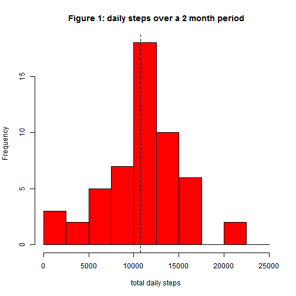
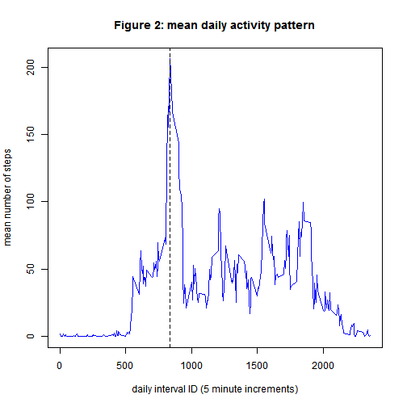
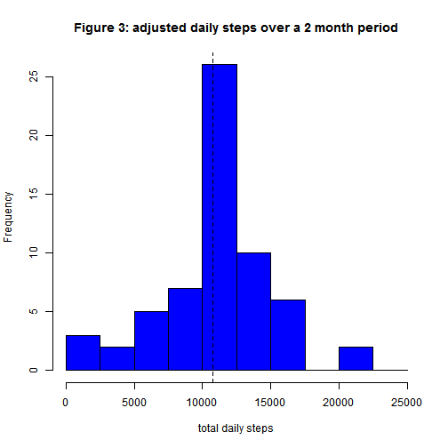
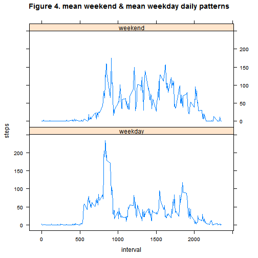

 

This R Markdown document contains my submission for peer assessment 1. The objective is to create an R markdown document chronicling a simple analysis of some 5 minute interval activity data gathered from a quantified-self enthusiast over a 2 month period.  The project requires the following components:  
1. load and preprocess the data,  
2. determine the daily total steps over the 2 month activity period,  
        + calculate the mean and median daily total steps,  
3. determine the average daily activity pattern - along 5 minute intervals,  
        + determine the interval with the maximum number of steps,  
4. develop and implement a strategy for imputing missing values,  
        + redo the section 2 tasks and compare,  
5. compare mean daily weekday and weekend activity patterns using the imputed data values.  
These components form the section outline for this document.  

### section 1. loading and preprocessing the data  
The file "activity.zip" which contains data for this analysis was obtained by forking rdpeng's GitHub repository "RepData_PeerAssessment1". The following code chunk unzips the file in the working directory and loads the file as a data frame named *activity*.


```r
unzip("activity.zip")
activity <- read.csv("activity.csv", stringsAsFactors=FALSE)
str(activity)
```

```
## 'data.frame':	17568 obs. of  3 variables:
##  $ steps   : int  NA NA NA NA NA NA NA NA NA NA ...
##  $ date    : chr  "2012-10-01" "2012-10-01" "2012-10-01" "2012-10-01" ...
##  $ interval: int  0 5 10 15 20 25 30 35 40 45 ...
```

Based on the project requirements, the following code preprocesses the data to:  
* convert data character string to date class, and  
* classify dates into "weekday" and "weekend" factor levels (for section 4 & 5 analyses).  


```r
activity$weekday <- strptime(activity$date, "%Y-%m-%d")
activity$weekday <- factor(weekdays(activity$weekday))
newlvls <- c("weekday", "weekday", "weekend", "weekend", "weekday", 
             "weekday", "weekday")
activity$weekday <- factor(newlvls[activity$weekday])
str(activity)
```

```
## 'data.frame':	17568 obs. of  4 variables:
##  $ steps   : int  NA NA NA NA NA NA NA NA NA NA ...
##  $ date    : chr  "2012-10-01" "2012-10-01" "2012-10-01" "2012-10-01" ...
##  $ interval: int  0 5 10 15 20 25 30 35 40 45 ...
##  $ weekday : Factor w/ 2 levels "weekday","weekend": 1 1 1 1 1 1 1 1 1 1 ...
```
The data frame *activity* contains missing values coded as "NA" in the steps column. These will be ignored for analysis in sections 2 and 3, and analyzed for "fixing" in section 4.

### section 2. total daily number of steps  
In the *activity* data set, each day has been divided in 288 5 minute intervals. The following code chunk sums the number of steps over those intervals to determine the daily total number of steps; this is summarized in a data frame *activitydailysum*.   

```r
library(reshape2)
activitydailysum <- melt(activity, id=c("date", "weekday"), 
                measure.vars=c("steps"), na.rm=TRUE)
activitydailysum <- dcast(activitydailysum, date+weekday~variable, sum)
```
As per the project instructions, missing values (NAs) were ignored. The histogram in Figure 1  shows the frequency of total daily number of steps over the 2 month period covered in the *activity* data set.

```r
hist(activitydailysum$steps, col="Red", breaks=seq(0, 25000, by=2500), 
                xlab="total daily steps", 
                main="Figure 1: daily steps over a 2 month period")
abline(v=mean(activitydailysum$steps), lty=2)
```

 
  
**Figure 1.** Histogram of the daily total steps over the 2 month period covered in the *activity* data set. The vertical dashed line indicates the mean total daily steps of 10766.2. The median total daily steps is similar at 10765.0.  

###section 3. average daily activity pattern  
The *activity* data set tracks approximately 2 months of activity. As noted above, each day has been divided in 288 5 minute intervals. The following code chunk determines the mean activity level, steps, for each interval across all of the days. Again, as per project instructions, missing values (NAs) were ignored.  

```r
activitydailypattern <- melt(activity, id=c("interval"), 
                measure.vars=c("steps"), na.rm=TRUE)
activitydailypattern <- dcast(activitydailypattern, interval~variable, mean)
```
The plot in Figure 2 shows the mean activity level, in steps, as a function of interval ID in the *activity* data set.  

```r
maxactivity <- subset(activitydailypattern, 
                activitydailypattern$steps == max(activitydailypattern$steps))
plot(activitydailypattern$interval, activitydailypattern$steps, 
                type="l", col="Blue", 
                xlab="daily interval ID (5 minute increments)", 
                ylab="mean number of steps", 
                main="Figure 2: mean daily activity pattern")
abline(v=maxactivity$interval, lty=2)
```

 

**Figure 2.** Mean daily activity pattern, shown as mean number of steps per interval ID for daily intervals. A day is comprised of 288 5 minute intervals. Intervals are identified by the hour in the day (24 hour basis) preppended to the five minute increment ID in that hour, *e.g.*, 1:15pm is interval 1315. The maximum in the daily pattern of steps is 206.2 at interval 835 and is indicated by the dashed vertical line in the plot.  

### section 4. imputing missing values and determining the impact  
The strategy I propose for imputing data for missing values (NAs) is based on how the missing values are distributed through the data set. For example, one might ask if NAs were distributed as small sequences of randomly placed missing values or as larger segments, as the answer might influence our approach to a replacement strategy. The following code chunk determines the sequence length of NAs in the *activity* data set.  

```r
activity$nodata <- is.na(activity$steps)
missingclusters <- rle(activity$nodata)
table(missingclusters$lengths, missingclusters$values)
```

```
##       
##        FALSE TRUE
##   288      0    6
##   576      1    1
##   864      1    0
##   1152     1    0
##   1728     1    0
##   4320     1    0
##   6624     1    0
```
This table shows that there are 2304 NAs (*i.e.*, True values) found in the activity data set. All of the NAs are part of whole day (288 intervals) or a two day missing sections. Therefore, a strategy we can adopt is to replace the missing NA section with the mean daily activity pattern.  
A preliminary analysis of the mean weekday *vs.* mean weekend activity pattern showed significant differences. So an additional component to the strategy should be to determine which mean activity pattern (weekday or weekend) to use for the replacement. The following code chunk determines:  
* the mean weekday and mean weekend activity patterns, and  
* finds NA sections and replaces NAs with the appropriate mean activity pattern.  
A new data set with imputed values is prepared, it is named *activityimputed*.  

```r
activitymeanpat <- melt(activity, id=c("interval", "weekday"), 
                measure.vars=c("steps"), na.rm=TRUE)
activitymeanpat <- dcast(activitymeanpat, interval+weekday~variable, 
                mean)
for (i in seq_along(activity$steps)){
        if(activity$nodata[i]==TRUE && activity$weekday[i]=="weekday"){
                activity$steps[i] <- activitymeanpat[activitymeanpat$weekday 
                        %in% "weekday", ]$steps[activitymeanpat[
                        activitymeanpat$weekday %in% "weekend", ]$interval 
                        == activity$interval[i]]
        } else if(activity$nodata[i]==TRUE && activity$weekday[i]=="weekend"){
                activity$steps[i] <- activitymeanpat[activitymeanpat$weekday 
                        %in% "weekend", ]$steps[activitymeanpat[
                        activitymeanpat$weekday %in% "weekend", ]$interval 
                        == activity$interval[i]]
        } else {
                activity$steps[i] <- activity$steps[i]
        }
}
activityimputed <- activity
str(activityimputed)
```

```
## 'data.frame':	17568 obs. of  5 variables:
##  $ steps   : num  2.333 0.462 0.179 0.205 0.103 ...
##  $ date    : chr  "2012-10-01" "2012-10-01" "2012-10-01" "2012-10-01" ...
##  $ interval: int  0 5 10 15 20 25 30 35 40 45 ...
##  $ weekday : Factor w/ 2 levels "weekday","weekend": 1 1 1 1 1 1 1 1 1 1 ...
##  $ nodata  : logi  TRUE TRUE TRUE TRUE TRUE TRUE ...
```
The structure of *activityimputed* shows that NA values have been replaced.  

As in section 2, the following code chunk determines the total daily steps, this time using the *activityimputed* data set. Results are plotted in the Figure 3 histogram.  

```r
activitydailysum2 <- melt(activityimputed, id=c("date"), 
                measure.vars=c("steps"), na.rm=TRUE)
activitydailysum2 <- dcast(activitydailysum2, date~variable, sum)
hist(activitydailysum2$steps, col="Blue", breaks=seq(0, 25000, by=2500), 
                xlab="total daily steps", 
                main="Figure 3: adjusted daily steps over a 2 month period")
abline(v=mean(activitydailysum2$steps), lty=2)
```

 
  
**Figure 3.** Histogram of the daily total steps over the 2 month period covered in the *activityimputed* data set. This data set has been adjusted to impute values for missing data as described above. The vertical dashed line indicates the mean total daily steps of 10762.1. The median total daily steps is now slightly lower than reported in section 2 at 10571.0.  
Replacing missing values using the impute strategy described above has left the mean virtually unchanged and shifted the median total daily steps to a slightly lower value. This is consistent with the impute strategy and coupled to the fact that 576 of 2304 NAs were from weekend days, roughly equivalent to the fraction (28.5%) of weekend days in a week. So, as expected, adding the impute data does not shift the histogram, rather just makes it more peaked. This can be seen by comparing Figures 3 to 1, from which it is evident that the principle change in Figure 3 has been to increase the frequency of occurences of total daily steps in the vicinity of the range of the mean total steps (10000-12500).

### section 5. mean weekday vs. mean weekend daily activity patterns   
In developing an impute strategy to replace missing values (NAs) in section 4, we noted that preliminary analysis showed that the weekday and weekend daily activity patterns differed. Using the *activityimputed* data set, mean weekday and mean weekend daily activity patterns were prepared using the following code.

```r
activitydailypatterns2 <- melt(activityimputed, id=c("interval", "weekday"), 
                measure.vars=c("steps"), na.rm=TRUE)
activitydailypatterns2 <- dcast(activitydailypatterns2, 
                interval+weekday~variable, mean)
```
Mean weekday activity starts earlier and its integral is slightly less (lower total steps on average) then mean weekend daily activity. Mean weekday activity has a higher peak value while mean weekend activity remains at a slightly higher level through the middle of the day. Results are shown in Figure 4.  


```r
library(lattice)
xyplot(steps~interval | weekday, data=activitydailypatterns2, 
                layout=c(1,2), type="l", 
                main="Figure 4. mean weekend & mean weekday daily patterns")
```

 
  
**Figure 4.** Mean weekend and mean weekday activity patterns as mean steps per 5 minute interval throughout a day (288 5 minute intervals per day). Patterns are mean patterns determined from 2 months of data recorded in the *activityimputed* data set. Missing values in the original *activity* data set were imputed using the process outlined in section 4.
